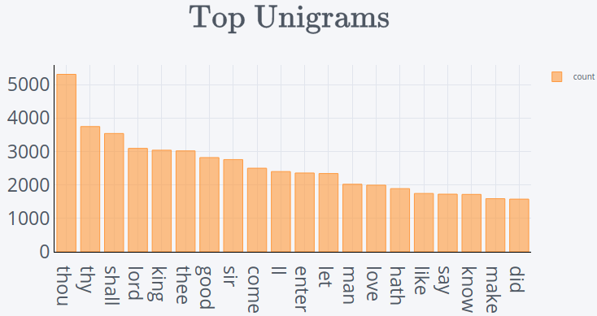
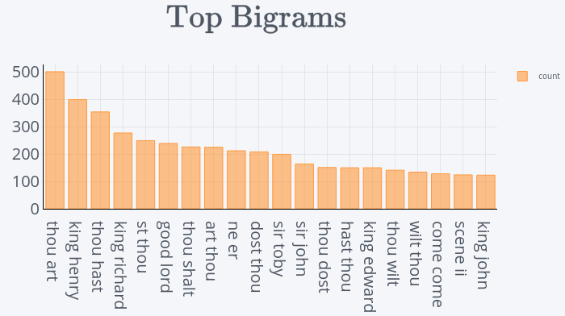

# Federated Learning for Text Generation

## Describe Project
When a user is typing text on a mobile device it can be useful to suggest the next word as this will optimize typing time and also avoid possible errors. However, this data has private information, which limits its movement to a centralized environment. In this paper we will demonstrate how to predict the next word while guaranteeing users privacy without moving the data around.

## Objectives
This work has how goals to predict the next word, ensuring data privacy. Sheakpeare pieces will be used as input data. These will be obtained, described, pre-processed and explored for a better understanding. Next, the federation environment will be created where each character in Sheakpeare's works will be a participating user, and their speeches will be the input dataset in the prediction model. From this scenario, in which data is only found on mobile devices, Federated Learning will be used to perform the model training in a shared way without moving the data to a centralized environment. For this, steps will be carried out to load a pre-trained global model from a central server, data pre-processing and model training on the user's own device. Then the model parameters will be forwarded to the central server to update the federated average and train the global model.

## Data Source
Data from [Project Gutenberg](https://www.gutenberg.org/): [Shakespeare play](http://www.gutenberg.org/files/100/old/1994-01-100.zip)

## Algorithms
TODO

## Quickstart
- [Data Undertanding, data cleansing, data exploration](https://github.com/brunocampos01/federated-Learning-for-text-generation/tree/master/notebooks)
- [Prepare federation, preprocess data, model, fed-avg, retraining and evaluate](https://github.com/brunocampos01/federated-Learning-for-text-generation/tree/master/notebooks)

## Requirements
This project is tested with:

| Requisite      | Version  |
|----------------|----------|
| Python         | 3.8.10   |
| Pip            | 21.2.4   |
| CUDA (optional)| 11.0     |

- [Install CUDA](https://www.tensorflow.org/install/gpu#install_cuda_with_apt)

## Image Display

#### WordCloud

#### N-grams

---

 

 

